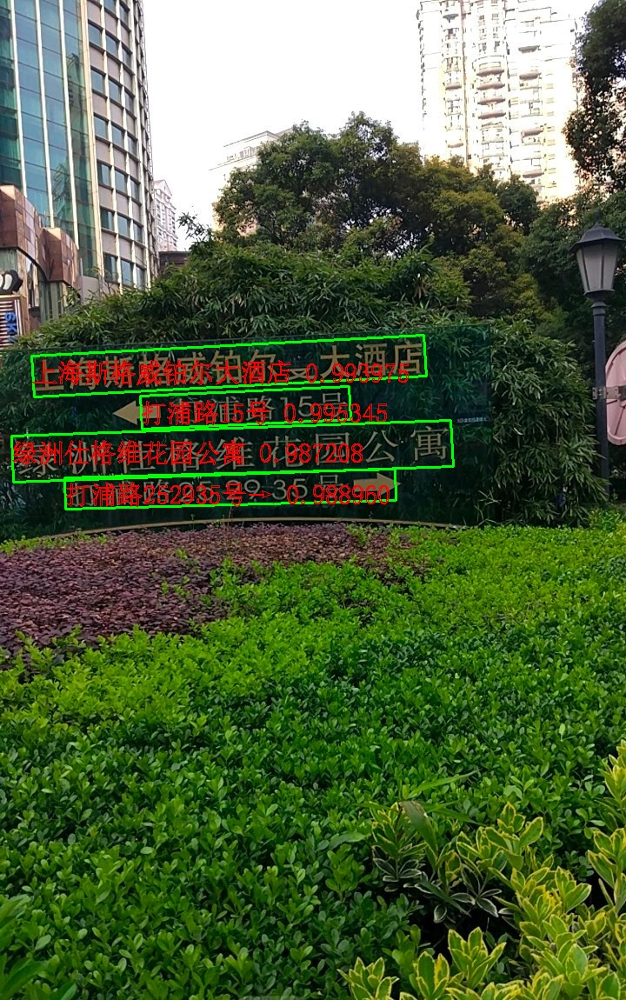
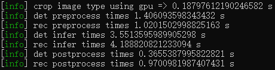

# PaddleOCRv4_TensorRT
## Enviroment
* cuda 12.4
* cudnn 8
* tensorrt-cuda12.1-trt10.1.0.27
* opencv 4.10.0 with cuda support
* opencv_freetype (optional, If you want show result in chinese)

## How to run
* modify the OpenCV_DIR, fmt_DIR, TensorRT_DIR, spglog_INCLUDE_DIRS path in **CmakeLists.txt**
* modify the path parameters.txt in **main.cpp**
```
 mkdir build
 cd build
 cmake ..
 make -j
 ./rec
```
## Result


In my PC => 12700 + rtx2080.
The time consumption is like these with 50 times model warmup and 1000 times inference.


# Thanks to

- [tensorrt-cpp-api](https://github.com/cyrusbehr/tensorrt-cpp-api) for creating a easy-to-use TensorRT C++ API Tutorial.

- [PaddleOCRv2_TensorRT](https://github.com/zwenyuan1/PaddleOCRv2_TensorRT) for creating some C++ implemention of PaddleOCR preprocess and postprocess method.

- [PaddleOCR](https://github.com/PaddlePaddle/PaddleOCR) for creating awesome and practical OCR tools that help users train better models and apply them into practice.